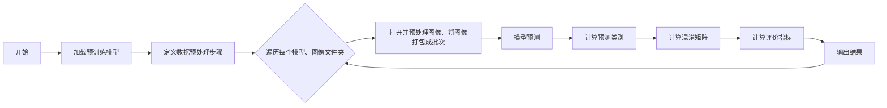

## **1．任务目标**

 

## **2．具体内容**

  ### **（1）实施方案**

#### 实验步骤

1. 初始训练:
   - 在原有的数据集上分别训练模型。
   - 测试每个模型在AIGC、对抗样本和同源数据集上的准确率。
2. 数据增强和再训练:
   - 将对抗样本、加噪数据和部分AIGC数据加入训练集。
   - 重新训练每个模型，并再次测试其在不同的AIGC、对抗样本和同源数据集上的表现。
3. 反复测试和优化:
   - 根据测试结果，不断优化数据增强和训练策略。
   - 反复进行训练和测试，逐步提高模型的准确率和鲁棒性。

#### 模型的选择

我们从`resnet18,resnet34,resnet50,efficientb0,efficientb3,vit`等6个模型中比较选择。由于在同源数据集上各个模型都比较高，所以只考虑了比较AIGC测试集正确率、对抗样本正确率 、加噪样本正确率的指标。

| 模型        | 模型可训练参数量 | AIGC测试集正确率 | 对抗样本正确率 | 加噪样本正确率 |
| ----------- | ---------------- | ---------------- | -------------- | -------------- |
| vit         | 85.5M            |                  |                |                |
| resnet18    | 11.2M            |                  |                |                |
| resnet34    | 22.4M            |                  |                |                |
| resnet50    | 23.5M            | 83.18%           | 93.06%         | 94.44%         |
| efficientb0 | 4.2M             |                  |                |                |
| efficientb3 | 10.6M            |                  |                |                |

发现**resnet34**的综合效果较好。其他模型表现欠佳的原因可能是**ResNet18**、**EfficientNet B0**属于较浅的残差网络，具有较少的参数和较低的计算复杂度，导致模型容易不鲁棒或过拟合。而**ViT、ResNet50**擅长处理大型数据集和复杂的视觉任务，具有较强的全局特征捕捉能力，但参数量过大，训练难度较高。

发现在训练中，模型**参数量较大**的模型通常难以训练，但它们在对抗样本和加噪样本方面具有较高的鲁棒性；相反，模型**参数量较小**的模型容易训练，但在应对复杂数据集和挑战性任务时可能表现不佳。

  ### **（2）核心代码分析**

#### dataset.py

为了增强模型的鲁棒性，对训练集和验证集分别应用不同的预处理和增强策略。

**数据增强**：

- 对于训练集：调整大小、随机旋转、随机水平翻转、随机更改图像的亮度、对比度、饱和度和色调、转换为张量和归一化。
- 对于验证集：调整大小和转换为张量。

#### train.py

#### test.py

可以同时处理多个文件夹和多个模型的的评估，并且可以通过stack批处理图像，并且还可以通过convert函数预测单通道的图像。

**预测数据可视化：**

对于二分类问题，混淆矩阵通常呈现如下形式：
$$
\begin{array}{cc} & \text{Predicted} \\ \text{Actual} & \begin{array}{cc} \text{Negative} & \text{Positive} \\ \end{array} \\ \begin{array}{c} \text{Negative} \\ \text{Positive} \\ \end{array} & \begin{array}{cc} \text{TN} & \text{FP} \\ \text{FN} & \text{TP} \\ \end{array} \end{array}
$$

- **TN（True Negative）**: 真负类，实际为负类（非暴力图像），预测也为负类。
- **FP（False Positive）**: 假正类，实际为负类（非暴力图像），但预测为正类（暴力图像）。
- **FN（False Negative）**: 假负类，实际为正类（暴力图像），但预测为负类（非暴力图像）。
- **TP（True Positive）**: 真正类，实际为正类（暴力图像），预测也为正类。

**准确率（Accuracy）**：评估模型整体的正确性，反映了模型在所有样本中的表现。表示模型预测正确的比例：
$$
\text{Accuracy} = \frac{\text{TP} + \text{TN}}{\text{TP} + \text{TN} + \text{FP} + \text{FN}}
$$
**精确率（Precision）**: 评估模型对正类（暴力图像）的预测准确性，避免了将太多负类（非暴力图像）错误分类为正类。
$$
\text{Precision}= \frac{\text{TP}}{\text{TP} +\text{FP} }
$$
**召回率（Recall）**: 评估模型对正类（暴力图像）的检出能力，避免漏掉实际为正类的样本。
$$
\text{Recall}= \frac{\text{TP}}{\text{TP} +\text{FN} }
$$
**F1 分数**: 综合考虑了精确率和召回率的平衡性，是一个对不平衡数据集更友好的评估指标。
$$
\text{F1 Score} = 2 \cdot \frac{\text{Precision} \cdot \text{Recall}}{\text{Precision} + \text{Recall}}
$$
**注：对于测试结果，尽可能给出分析图**

###  **（3）测试结果分析**

## **3．工作总结**

**（1）收获、心得**

**（2）遇到问题及解决思路**

 

**4．课程建议**